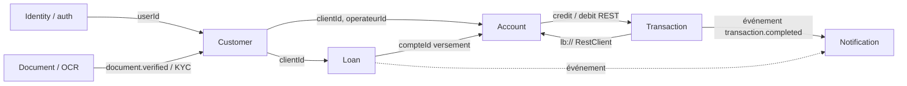

# Analyse Domain-Driven Design (DDD) — Plateforme Bancaire Distribuée

> Livrable n°2 du TP INF462 — étude reflétant l'implémentation réelle.

## 1. Langage ubiquitaire (Ubiquitous Language)

| Terme | Définition métier |
|-------|-------------------|
| **Client** | Personne physique détentrice de comptes/prêts, rattachée à un opérateur. |
| **Opérateur financier** | Banque, microfinance ou opérateur mobile ; possède ses propres règles. |
| **Utilisateur** | Compte de connexion (identifiants + rôles) ; un client est lié à un utilisateur. |
| **KYC** | *Know Your Customer* : statut de vérification d'identité (EN_ATTENTE/VALIDE/REJETE). |
| **Compte** | Compte financier d'un client (solde, devise, plafond, découvert, statut). |
| **Transaction** | Dépôt, retrait ou transfert ; possède une référence, un montant, une commission, un statut. |
| **Transfert intra/inter-opérateur** | Transfert entre 2 comptes du même opérateur / d'opérateurs différents. |
| **Commission** | Frais prélevés sur une opération (ex. transfert inter-opérateur). |
| **Plafond journalier** | Montant maximal retirable/transférable par jour. |
| **Demande de prêt** | Sollicitation de financement par un client (montant, durée, motif, score de risque). |
| **Prêt** | Crédit accordé après approbation d'une demande (capital, taux, échéancier). |
| **Échéance** | Ligne de l'échéancier (capital + intérêt dus à une date). |
| **Remboursement** | Paiement d'une échéance. |
| **Document** | Pièce numérique soumise (CNI, passeport…) analysée par OCR. |
| **Notification** | Message (email/SMS/push) émis suite à un événement métier. |

## 2. Sous-domaines

| Sous-domaine | Type | Justification |
|--------------|------|---------------|
| **Prêts** | **Core** | Cœur de valeur, règles complexes (scoring, amortissement). |
| **Transactions / Transferts** | **Core** | Différenciant : intra/inter-opérateurs, commissions, cohérence. |
| **Comptes** | Supporting | Indispensable mais standard. |
| **Clients / KYC** | Supporting | Gestion d'identité métier + conformité. |
| **Documents & OCR/IA** | Supporting | Alimente KYC et prêts ; techno spécialisée (Python). |
| **Authentification** | Generic | Mécanisme standard (mot de passe, Google, JWT). |
| **Notifications** | Generic | Canal d'information réutilisable. |
| **Opérateurs** | Supporting | Référentiel des établissements partenaires. |

## 3. Bounded Contexts → microservices

| Bounded Context | Microservice | Techno | Base |
|-----------------|--------------|--------|------|
| Identity | `auth-service` | Java | `bank_auth_db` |
| Customer | `customer-service` | Java | `bank_customer_db` |
| Account | `account-service` | Java | `bank_account_db` |
| Transaction | `transaction-service` | Java | `bank_transaction_db` |
| Loan | `loan-service` | Java | `bank_loan_db` |
| Document/AI | `ai-document-service` | Python | SQLite |
| Notification | `notification-service` | Node.js | (en mémoire) |

> 1 Bounded Context = 1 microservice = 1 base (**database per service**). Aucune
> jointure inter-bases : on référence par identifiant + on synchronise par événements.

### Context Map (relations entre contextes)

- **Customer → Account/Loan** : *Customer/Supplier* (amont fournit l'identité client).
- **Transaction → Account** : *Conformist* via API REST (`lb://account-service`), protégé par **circuit breaker**.
- **Document → Customer** : *Open Host* (le résultat OCR alimente le KYC).
- **Transaction/Loan → Notification** : communication **asynchrone** (RabbitMQ), découplée.

## 4. Agrégats, Entités, Value Objects

| Bounded Context | Aggregate Root | Entités / VO | Invariants clés |
|-----------------|----------------|--------------|-----------------|
| Identity | `Utilisateur` | + `Role` (enum, `@ElementCollection`) | email unique ; mot de passe haché (BCrypt). |
| Customer | `Client` | `Operateur` ; VO `Adresse` (`@Embeddable`) | email unique ; KYC initial EN_ATTENTE. |
| Account | `Compte` | — | solde ≥ −découvert ; retrait ≤ plafond ; clôture si solde = 0. |
| Transaction | `Transaction` | — | montant > 0 ; débit ≤ solde+découvert ; référence unique. |
| Loan | `Pret` | `DemandePret`, `Echeance`, `Remboursement` | Pret créé seulement si demande APPROUVEE ; Σ échéances = capital+intérêts. |
| Document | `Document` | `ResultatOCR` | 1 document → 1 résultat OCR. |
| Notification | `Notification` | — | une notification par événement consommé. |

> Les relations `@ManyToOne`/`@OneToMany` ne sont utilisées qu'**à l'intérieur** d'un
> agrégat/contexte (ex. `Pret → Echeance`). Jamais entre microservices.

## 5. Événements métier (Domain Events)

| Événement | Émis par | Consommé par | Transport |
|-----------|----------|--------------|-----------|
| `transaction.completed` | transaction | notification | RabbitMQ (`banking.events`) ✅ implémenté |
| `transaction.rejected` | transaction | notification | RabbitMQ |
| `document.verified` (→ KYC) | ai-document / front | customer | (orchestré côté front actuellement) |
| `loan.approved` | loan | notification, account | (perspective) |
| `loan.installment.overdue` | loan | notification | (perspective) |

## 6. Communications

| Type | Cas | Mécanisme |
|------|-----|-----------|
| **Synchrone** | front→services, transaction→account | REST via **API Gateway** + **Eureka** (`lb://`) |
| **Asynchrone** | transaction→notification | **RabbitMQ** (exchange topic `banking.events`) |

## 7. Justification du découpage

- **Alignement Bounded Contexts ↔ microservices** : chaque service a un modèle cohérent et une base dédiée → couplage faible, cohésion forte.
- **Scalabilité indépendante** : les services Core (transaction, loan) peuvent être mis à l'échelle séparément.
- **Polyglottisme assumé** : OCR en Python (écosystème IA), notifications en Node (I/O asynchrone), métier bancaire en Java/Spring (robustesse, transactions).
- **Résilience** : circuit breaker (transaction→account), communications asynchrones découplées, configuration centralisée, découverte de services.
