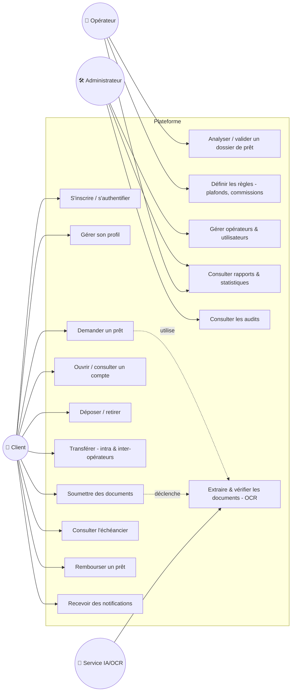
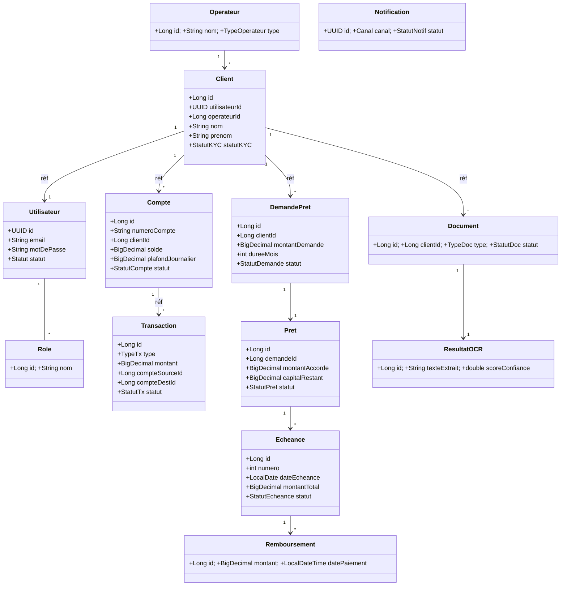
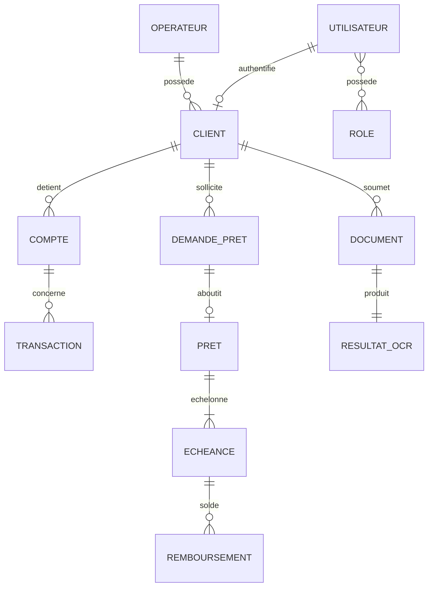
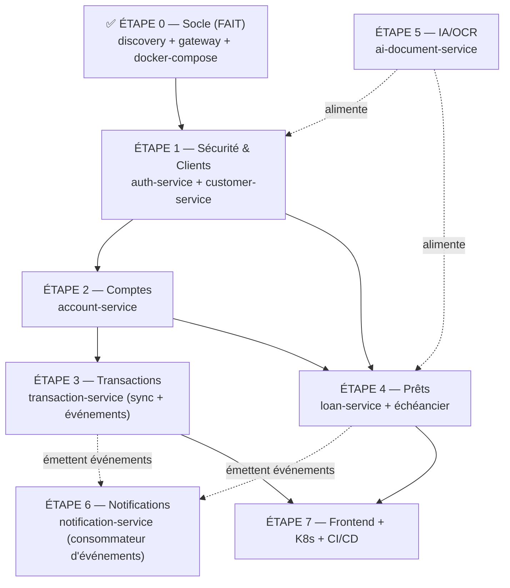

# Modèle de domaine, diagrammes & plan de travail

> Document de conception du TP INF462 — plateforme bancaire distribuée.
> Les diagrammes sont écrits en **Mermaid** : ils s'affichent directement dans
> VSCode (extension « Markdown Preview Mermaid Support ») et sur GitHub.

## Sommaire
1. [Vue d'ensemble : services et données](#1-vue-densemble--quel-service-détient-quelles-données)
2. [Entités, attributs et relations](#2-entités-attributs-et-relations)
3. [Diagramme de cas d'utilisation](#3-diagramme-de-cas-dutilisation)
4. [Diagramme de classes](#4-diagramme-de-classes)
5. [MCD — Modèle Conceptuel de Données](#5-mcd--modèle-conceptuel-de-données)
6. [MLD — Modèle Logique de Données](#6-mld--modèle-logique-de-données)
7. [Par quoi commencer ?](#7-par-quoi-commencer-)
8. [Répartition de l'équipe](#8-répartition-de-léquipe)
9. [Démarche anti-conflits (étape par étape)](#9-démarche-anti-conflits-étape-par-étape)

---

## 1. Vue d'ensemble : quel service détient quelles données

**Principe « database per service »** : chaque microservice possède SA base.
Aucune clé étrangère entre services — on référence par **identifiant** et on
synchronise par **événements**.

| Service | Techno | Base | Entités détenues |
|---------|--------|------|------------------|
| **auth-service** *(à créer)* | Java | `bank_auth_db` | `Utilisateur`, `Role` |
| **customer-service** | Java | `bank_customer_db` | `Client`, `Operateur`, `Adresse` |
| **account-service** | Java | `bank_account_db` | `Compte` |
| **transaction-service** | Java | `bank_transaction_db` | `Transaction` |
| **loan-service** | Java | `bank_loan_db` | `DemandePret`, `Pret`, `Echeance`, `Remboursement` |
| **ai-document-service** | Python | `bank_document_db` | `Document`, `ResultatOCR` |
| **notification-service** | Node.js | `bank_notification_db` | `Notification` |
| **(transversal)** | — | — | `AuditLog` (dans le service qui produit l'action, ou un audit-service) |

> Les liens « inter-services » (ex : un `Compte` appartient à un `Client`) sont
> de simples champs `clientId` — **pas** de jointure SQL entre bases.

---

## 2. Entités, attributs et relations

### 🔐 auth-service
**Utilisateur** — compte de connexion (tous rôles confondus)
| Attribut | Type | Notes |
|----------|------|-------|
| id | UUID/Long | PK |
| email | String | unique |
| motDePasse | String | **haché** (BCrypt) |
| telephone | String | |
| statut | Enum | ACTIF, SUSPENDU |
| dateCreation | DateTime | |

**Role** — CLIENT, ADMIN, OPERATEUR. Relation `Utilisateur *—* Role` (n..n).

### 👤 customer-service
**Client** — personne détenant comptes/prêts
| Attribut | Type | Notes |
|----------|------|-------|
| id | Long | PK |
| utilisateurId | UUID | réf. auth-service |
| operateurId | Long | réf. opérateur |
| nom, prenom | String | |
| dateNaissance | Date | |
| email, telephone | String | |
| numeroIdentite | String | n° CNI/passeport |
| typePiece | Enum | CNI, PASSEPORT |
| statutKYC | Enum | EN_ATTENTE, VALIDE, REJETE |
| dateInscription | DateTime | |

**Operateur** — banque / microfinance / opérateur mobile
| Attribut | Type |
|----------|------|
| id | Long (PK) |
| nom | String |
| type | Enum (BANQUE, MICROFINANCE, MOBILE) |
| code | String (unique) |

**Adresse** *(Value Object, intégré au Client)* : rue, ville, pays, codePostal.

Relations : `Operateur 1—n Client` · `Client 1—1 Utilisateur` (réf.).

### 💳 account-service
**Compte**
| Attribut | Type | Notes |
|----------|------|-------|
| id | Long | PK |
| numeroCompte | String | unique |
| clientId | Long | réf. customer |
| operateurId | Long | réf. opérateur |
| type | Enum | COURANT, EPARGNE |
| solde | Decimal | |
| devise | String | XAF, EUR... |
| plafondJournalier | Decimal | |
| decouvertAutorise | Decimal | |
| statut | Enum | ACTIF, BLOQUE, CLOTURE |
| dateOuverture | DateTime | |

Relation : `Client 1—n Compte` (réf.).

### 💸 transaction-service
**Transaction**
| Attribut | Type | Notes |
|----------|------|-------|
| id | Long | PK |
| reference | String | unique |
| type | Enum | DEPOT, RETRAIT, TRANSFERT |
| montant | Decimal | |
| devise | String | |
| compteSourceId | Long | réf. compte (null si dépôt) |
| compteDestId | Long | réf. compte (null si retrait) |
| operateurSourceId | Long | pour inter-opérateurs |
| operateurDestId | Long | |
| commission | Decimal | |
| statut | Enum | INITIEE, VALIDEE, REJETEE |
| motif | String | |
| dateOperation | DateTime | |

Relation : `Compte 1—n Transaction` (réf. via source/destination).

### 🏦 loan-service
**DemandePret**
| Attribut | Type | Notes |
|----------|------|-------|
| id | Long | PK |
| clientId | Long | réf. customer |
| montantDemande | Decimal | |
| dureeMois | Int | |
| motif | String | |
| scoreRisque | Decimal | calculé (IA) |
| statut | Enum | SOUMISE, EN_ANALYSE, APPROUVEE, REJETEE |
| dateSoumission | DateTime | |

**Pret** (créé quand la demande est approuvée)
| Attribut | Type | Notes |
|----------|------|-------|
| id | Long | PK |
| demandeId | Long | réf. DemandePret (1—1) |
| clientId | Long | réf. customer |
| compteId | Long | réf. compte de versement |
| montantAccorde | Decimal | |
| tauxInteret | Decimal | |
| dureeMois | Int | |
| capitalRestant | Decimal | |
| statut | Enum | ACTIF, SOLDE, EN_DEFAUT |
| dateDeblocage | DateTime | |

**Echeance** (lignes de l'échéancier)
| Attribut | Type |
|----------|------|
| id | Long (PK) |
| pretId | Long (FK interne) |
| numero | Int |
| dateEcheance | Date |
| montantCapital | Decimal |
| montantInteret | Decimal |
| montantTotal | Decimal |
| statut | Enum (A_PAYER, PAYEE, EN_RETARD) |

**Remboursement**
| Attribut | Type |
|----------|------|
| id | Long (PK) |
| echeanceId | Long (FK interne) |
| montant | Decimal |
| datePaiement | DateTime |
| moyenPaiement | Enum (COMPTE, MOBILE...) |

Relations internes : `DemandePret 1—1 Pret` · `Pret 1—n Echeance` · `Echeance 1—n Remboursement`.

### 📄 ai-document-service
**Document**
| Attribut | Type | Notes |
|----------|------|-------|
| id | Long/UUID | PK |
| clientId | Long | réf. customer |
| type | Enum | CNI, PASSEPORT, JUSTIF_DOMICILE, BULLETIN_SALAIRE, RELEVE, CONTRAT, ADMIN |
| urlFichier | String | stockage objet |
| statut | Enum | SOUMIS, VERIFIE, REJETE |
| dateSoumission | DateTime | |

**ResultatOCR**
| Attribut | Type | Notes |
|----------|------|-------|
| id | Long/UUID | PK |
| documentId | réf. | 1—1 |
| texteExtrait | Text | |
| donneesStructurees | JSON | champs extraits |
| scoreConfiance | Decimal | |
| dateTraitement | DateTime | |

Relation : `Document 1—1 ResultatOCR`.

### 🔔 notification-service
**Notification**
| Attribut | Type |
|----------|------|
| id | UUID (PK) |
| destinataireId | réf. utilisateur/client |
| canal | Enum (SMS, EMAIL, PUSH) |
| sujet | String |
| contenu | Text |
| statut | Enum (EN_ATTENTE, ENVOYEE, ECHEC) |
| evenementSource | String (ex: PretApprouve) |
| dateCreation, dateEnvoi | DateTime |

---

## 3. Diagramme de cas d'utilisation



---

## 4. Diagramme de classes



> ⚠️ Les associations marquées « réf » traversent une frontière de service :
> en base, ce sont des identifiants, pas des relations SQL.

---

## 5. MCD — Modèle Conceptuel de Données

Notation Merise (cardinalités min,max).

| Association | Entité A | Card. | Entité B | Card. |
|-------------|----------|-------|----------|-------|
| Possède | OPERATEUR | (1,n) | CLIENT | (1,1) |
| Détient | CLIENT | (1,n) | COMPTE | (1,1) |
| Concerne | COMPTE | (0,n) | TRANSACTION | (1,2)* |
| Sollicite | CLIENT | (0,n) | DEMANDE_PRET | (1,1) |
| Aboutit | DEMANDE_PRET | (0,1) | PRET | (1,1) |
| Échelonne | PRET | (1,n) | ECHEANCE | (1,1) |
| Solde | ECHEANCE | (1,n) | REMBOURSEMENT | (1,1) |
| Soumet | CLIENT | (0,n) | DOCUMENT | (1,1) |z
| Produit | DOCUMENT | (1,1) | RESULTAT_OCR | (1,1) |
| Authentifie | UTILISATEUR | (1,1) | CLIENT | (0,1) |
| Possède (rôle) | UTILISATEUR | (1,n) | ROLE | (1,n) |

\* une transaction référence 1 (dépôt/retrait) ou 2 comptes (transfert).



---

## 6. MLD — Modèle Logique de Données

Schéma relationnel (PK soulignée = `*PK*`, clé étrangère = `#FK`). Rappel :
les `#` inter-services sont logiques (pas de contrainte SQL cross-base).

```
UTILISATEUR(*id*, email, mot_de_passe, telephone, statut, date_creation)
ROLE(*id*, nom)
UTILISATEUR_ROLE(*#utilisateur_id*, *#role_id*)

OPERATEUR(*id*, nom, type, code)
CLIENT(*id*, #utilisateur_id, #operateur_id, nom, prenom, date_naissance,
       email, telephone, numero_identite, type_piece, statut_kyc,
       rue, ville, pays, code_postal, date_inscription)

COMPTE(*id*, numero_compte, #client_id, #operateur_id, type, solde, devise,
       plafond_journalier, decouvert_autorise, statut, date_ouverture)

TRANSACTION(*id*, reference, type, montant, devise, #compte_source_id,
            #compte_dest_id, #operateur_source_id, #operateur_dest_id,
            commission, statut, motif, date_operation)

DEMANDE_PRET(*id*, #client_id, montant_demande, duree_mois, motif,
             score_risque, statut, date_soumission)
PRET(*id*, #demande_id, #client_id, #compte_id, montant_accorde, taux_interet,
     duree_mois, capital_restant, statut, date_deblocage)
ECHEANCE(*id*, #pret_id, numero, date_echeance, montant_capital,
         montant_interet, montant_total, statut)
REMBOURSEMENT(*id*, #echeance_id, montant, date_paiement, moyen_paiement)

DOCUMENT(*id*, #client_id, type, url_fichier, statut, date_soumission)
RESULTAT_OCR(*id*, #document_id, texte_extrait, donnees_structurees,
             score_confiance, date_traitement)

NOTIFICATION(*id*, destinataire_id, canal, sujet, contenu, statut,
             evenement_source, date_creation, date_envoi)
```

---

## 7. Par quoi commencer ?

Suivre le **chemin de dépendances** (chaque étape débloque la suivante) :



**Commencez par `customer-service`** (avec `auth-service` en parallèle) : c'est la
racine de presque tout (un client précède un compte, un prêt, un document).
`customer-service` a déjà une config BDD → c'est le **modèle de référence** à
implémenter en premier (entité → repository → service → contrôleur REST → DTO),
puis chacun duplique ce patron dans son service.

---

## 8. Répartition de l'équipe

Travaillez **par service / bounded context** (et non par couche) → chacun reste
dans son dossier, donc **peu ou pas de conflits Git**. Adaptez à la taille réelle
de l'équipe (exemple pour 5).

| Membre | Service(s) responsable(s) | Techno |
|--------|---------------------------|--------|
| **Dev 1 (lead infra)** | discovery, gateway, config, **auth-service**, sécurité JWT, docker-compose/K8s/CI-CD | Java + DevOps |
| **Dev 2** | **customer-service** (modèle de référence) + Operateur | Java |
| **Dev 3** | **account-service** + **transaction-service** | Java |
| **Dev 4** | **loan-service** (demande, échéancier, remboursement) | Java |
| **Dev 5** | **notification-service** (Node) + **ai-document-service** (Python/OCR) + frontend | JS/Python |

> Le **frontend** peut être partagé : chacun fait l'écran de son service.
> L'**analyse DDD + ce modèle de données** se valident **ensemble** au début.

---

## 9. Démarche anti-conflits (étape par étape)

La règle d'or : **on se met d'accord sur les *contrats* (API + événements) AVANT
de coder**. Tant que les interfaces sont figées, chacun code son service sans
gêner les autres.

### Phase A — Cadrage commun (tous ensemble, jours 1-3)
- [ ] Valider [l'analyse DDD](01-analyse-ddd.md), [le cahier des charges](02-cahier-des-charges.md) et **ce modèle de données**.
- [ ] **Figer les contrats** dans `docs/contracts/` :
  - les **endpoints REST** de chaque service (méthode, chemin, DTO entrée/sortie) ;
  - les **événements** (nom, payload JSON) : `ClientCree`, `CompteCree`, `DepotEffectue`, `TransfertInitie`, `PretApprouve`, `DocumentVerifie`, `EcheanceImpayee`…
- [ ] Définir les conventions communes (format d'erreur, nommage, codes HTTP).

### Phase B — Squelette en parallèle (jours 3-5)
Chacun, **dans son propre service** (donc aucun conflit) :
- [ ] crée les **entités JPA** + `Repository` ;
- [ ] crée les **DTO** correspondant aux contrats figés ;
- [ ] crée un **contrôleur REST** qui renvoie des données bouchonnées (mock) ;
- [ ] vérifie l'enregistrement dans Eureka et l'accès via la Gateway.

### Phase C — Logique métier (jours 5-11)
- [ ] Chacun implémente les règles de son service (invariants, validations).
- [ ] Mise en place de la **communication** : appels REST via la Gateway (sync) et
      publication/consommation d'**événements RabbitMQ** (async).
- [ ] **Dev 5** branche l'OCR/IA et le service de notifications sur les événements.

### Phase D — Intégration, conteneurs, déploiement (jours 11-15)
- [ ] Activer notification & ai-document dans `docker-compose.yml`.
- [ ] Manifests **Kubernetes** (`k8s/`), **CI/CD** (`.github/workflows/`).
- [ ] Tests bout-en-bout, observabilité, **rapport** et **démo**.

### Règles Git (à respecter par tous)
- **Jamais** de commit direct sur `main`. Une **branche par fonctionnalité** :
  `feat/customer-entite`, `feat/loan-echeancier`…
- `git pull origin main` **chaque matin** avant de coder.
- Petites **Pull Requests** relues par un binôme avant fusion.
- Comme chacun travaille dans son dossier de service, les seuls fichiers partagés
  (`docker-compose.yml`, `pom` parent, `docs/contracts/`) sont modifiés **avec
  prudence** et idéalement par une seule personne à la fois.

---

👉 **Action immédiate** : valider ce modèle en équipe, puis **Dev 2 démarre
`customer-service`** comme modèle de référence pendant que **Dev 1** met en place
`auth-service` + la sécurité.
