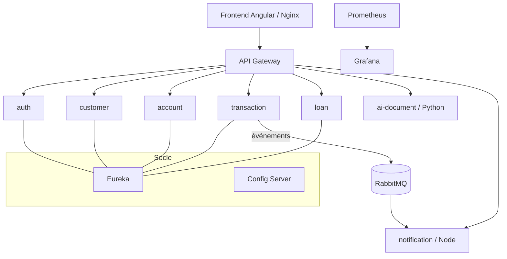

# Rapport technique — Plateforme Bancaire Distribuée (INF462)

## 1. Objectif et périmètre
Plateforme financière distribuée en microservices permettant à plusieurs opérateurs
de gérer clients, comptes, transactions, prêts, documents (OCR/IA) et notifications,
avec une expérience homogène, sécurisée et scalable.

## 2. Architecture retenue

- **Microservices** : 1 service = 1 Bounded Context = 1 base (*database per service*).
- **Polyglotte** : Java/Spring (métier), Python/FastAPI (OCR), Node.js (notifications), Angular (UI).
- **Socle Cloud Native** : API Gateway (Spring Cloud Gateway), découverte (Eureka),
  configuration centralisée (Spring Cloud Config), conteneurisation (Docker), orchestration (Kubernetes), CI/CD (GitHub Actions), observabilité (Prometheus/Grafana).

## 3. Choix techniques et justifications

| Choix | Justification |
|-------|---------------|
| **Spring Boot / Spring Cloud** | Écosystème mûr pour microservices (gateway, eureka, config, resilience4j). |
| **API Gateway comme point d'entrée unique** | Centralise routage, sécurité (JWT) et traçabilité (audit). |
| **JWT stateless** | Pas de session serveur → scalabilité horizontale. |
| **Database per service** | Découplage fort, autonomie des équipes, pas de point de couplage par la BDD. |
| **REST synchrone + RabbitMQ asynchrone** | Synchrone pour les besoins immédiats ; asynchrone pour découpler les notifications. |
| **Python pour l'OCR** | Tesseract + OpenCV : meilleur écosystème IA/traitement d'image. |
| **Node pour les notifications** | Modèle événementiel/I-O non bloquant adapté à un consommateur de messages. |
| **resilience4j (circuit breaker)** | Évite l'effet domino si account-service tombe. |
| **2 mécanismes d'authentification** | Mot de passe (BCrypt) + Google (OAuth2/ID token) comme l'exige le sujet. |

## 4. Sécurité
- Mots de passe **hachés BCrypt**, jamais stockés en clair.
- **JWT** signé (HS384), vérifié **à la gateway** (filtre global) avant routage.
- Propagation de l'identité aux services via en-têtes `X-User-Email` / `X-User-Roles`.
- **Autorisation par rôle** côté front (espaces client/opérateur/admin) via le rôle du JWT.
- **Connexion Google** : l'ID token Google est vérifié côté `auth-service`, qui émet ensuite notre JWT.

## 5. Résilience, concurrence, observabilité
- **Circuit breaker** resilience4j sur `transaction → account` (ignore les erreurs métier).
- **Découverte + load balancing** (`lb://`) → tolérance au déplacement/redémarrage des instances.
- **Traçabilité** : la gateway journalise chaque requête (méthode, chemin, utilisateur, statut, durée).
- **Métriques** : `/actuator/prometheus` exposé, scrappé par **Prometheus**, visualisé via **Grafana**.

## 6. Difficultés rencontrées et solutions
| Difficulté | Solution |
|-----------|----------|
| Renommage d'artefacts Spring Cloud 2025.x (gateway) | `spring-cloud-starter-gateway-server-webflux` + config sous `spring.cloud.gateway.server.webflux.*`. |
| Build Maven en conteneur instable (réseau/DNS) | Dockerfiles **jar-préconstruit** (build sur la machine puis copie). |
| transaction-service ne s'enregistrait pas dans Eureka | Le bean `@LoadBalanced RestClient.Builder` était capté par le transport Eureka → ajout d'un `@Primary` non load-balancé. |
| Hétérogénéité des variables d'env entre contributions | Harmonisation dans `docker-compose.yml` (DB_URL/DB_USERNAME, EUREKA_URL, profils). |
| Broker d'événements (Kafka prévu vs RabbitMQ du consommateur) | Ajout d'un publisher RabbitMQ activable par `transaction.events.broker=rabbitmq`. |
| Authentification RabbitMQ refusée | Alignement des identifiants (`SPRING_RABBITMQ_USERNAME/PASSWORD`). |

## 7. Compromis assumés
- **Cohérence des transferts** : pas de saga/2PC complet ; gestion du cas simple + circuit breaker (à étendre par une saga avec compensation — l'événement `transaction.compensation.requested` est déjà prévu).
- **OCR ↔ KYC** : l'orchestration (rattachement document→client, validation KYC) est faite côté front ; pourrait être déplacée dans un flux événementiel backend.
- **Notifications** : historique en mémoire (suffisant pour la démo) plutôt qu'en base.
- **Kubernetes** : manifests fournis et validés, non déployés (pas de cluster sur la machine de dev).

## 8. Perspectives d'évolution
- Saga/compensation pour les transferts inter-opérateurs.
- Vérification automatique des informations OCR + scoring de prêt par IA.
- Service d'audit persistant + agrégation de logs (ELK), tracing distribué (OpenTelemetry).
- Déploiement K8s réel + autoscaling (HPA) + secrets gérés (Vault).
- Push des images vers un registre dans la CI + déploiement continu.
