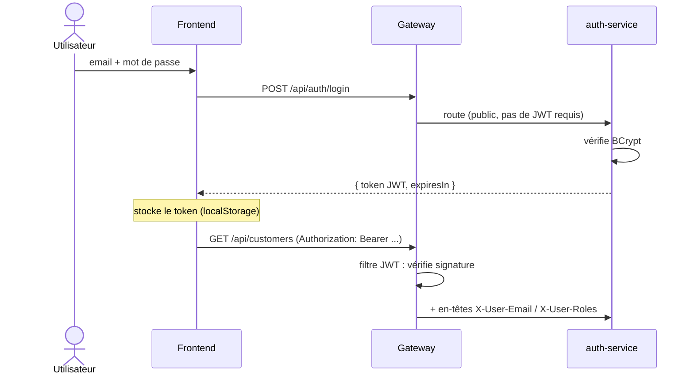
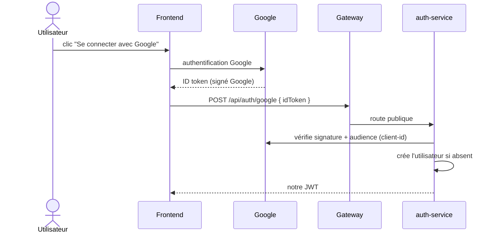
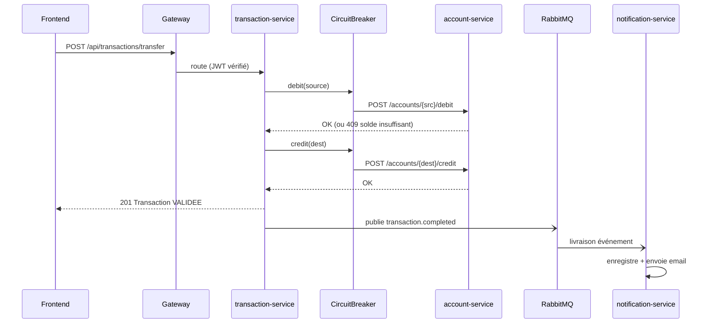
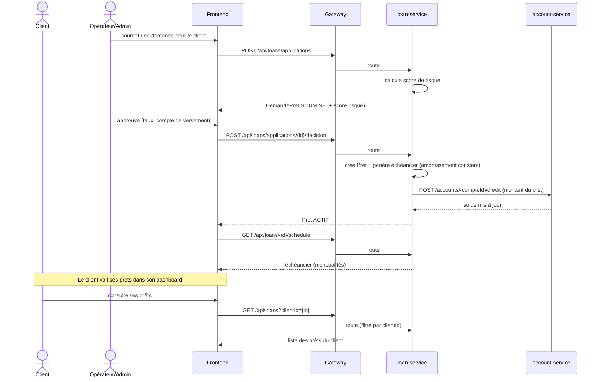
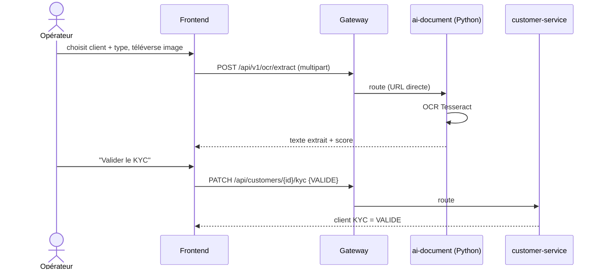
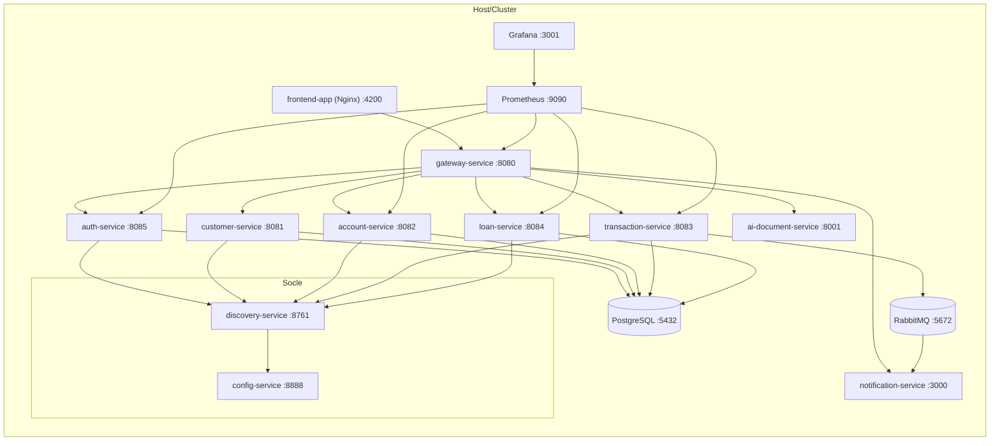

# Diagrammes de séquence & de déploiement

Diagrammes Mermaid (s'affichent dans VSCode / GitHub).

## 1. Séquence — Authentification (mot de passe + JWT)

## 2. Séquence — Connexion Google

## 3. Séquence — Transfert (synchrone + circuit breaker + événement async)

## 4. Séquence — Prêt (demande → décision → échéancier → crédit compte)

## 5. Séquence — OCR alimentant le KYC

## 6. Diagramme de déploiement (conteneurs)

> Réseau Docker `bank-net` (ou namespace K8s `banking`). Chaque service Java possède
> sa base logique dans l'instance PostgreSQL (database per service).
