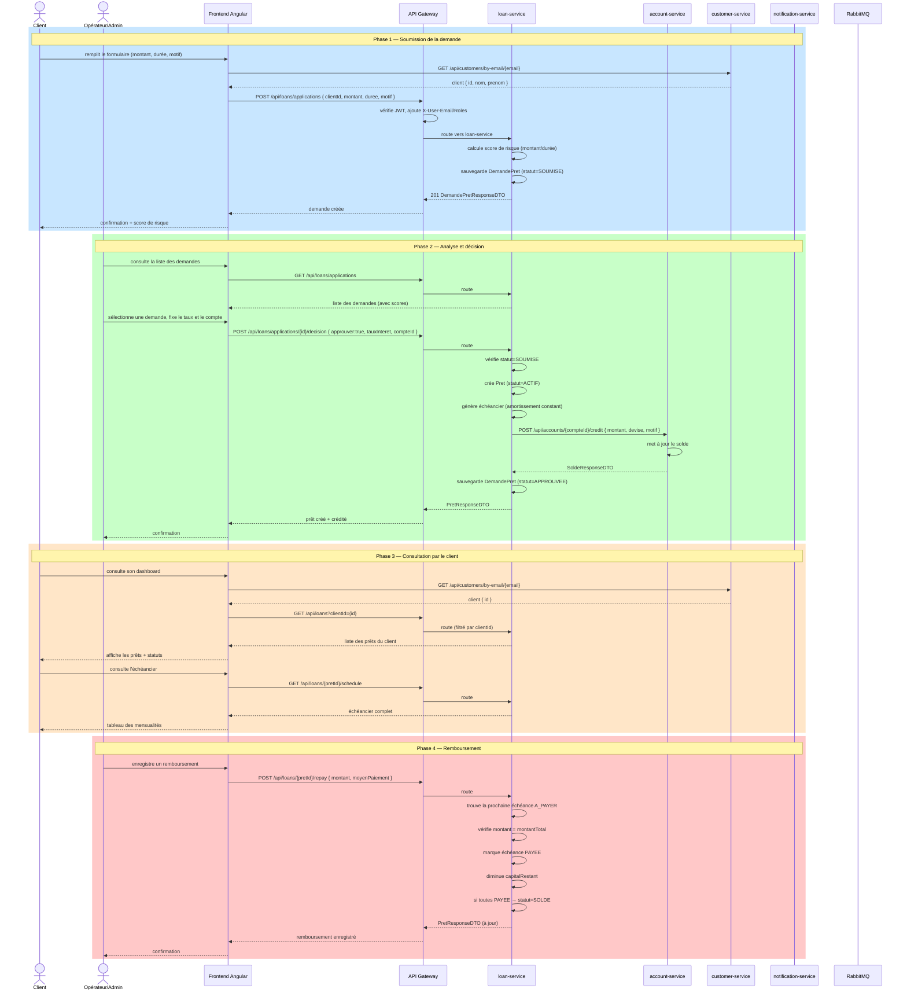

# Diagramme de cas d'utilisation — Plateforme Bancaire

Diagrammes Mermaid (s'affichent dans VSCode / GitHub).

## 1. Cas d'utilisation — Client

```mermaid
flowchart LR
    actor CL["👤 Client"]

    CL --> UC1["S'inscrire"]
    CL --> UC2["Se connecter (email/Google)"]
    CL --> UC3["Consulter ses comptes"]
    CL --> UC4["Consulter son solde"]
    CL --> UC5["Effectuer un dépôt"]
    CL --> UC6["Effectuer un retrait"]
    CL --> UC7["Transférer entre ses comptes"]
    CL --> UC8["Demander un prêt"]
    CL --> UC9["Consulter ses prêts"]
    CL --> UC10["Consulter l'échéancier"]
    CL --> UC11["Rembourser un prêt"]
    CL --> UC12["Consulter ses notifications"]
    CL --> UC13["Consulter ses transactions"]
```

## 2. Cas d'utilisation — Opérateur financier

```mermaid
flowchart LR
    actor OP["🏦 Opérateur"]

    OP --> UC1["Gérer les clients"]
    OP --> UC2["Valider le KYC d'un client"]
    OP --> UC3["Ouvrir un compte"]
    OP --> UC4["Suspendre/Clôturer un compte"]
    OP --> UC5["Effectuer un dépôt client"]
    OP --> UC6["Effectuer un retrait client"]
    OP --> UC7["Transférer inter-opérateurs"]
    OP --> UC8["Analyser un document (OCR)"]
    OP --> UC9["Évaluer une demande de prêt"]
    OP --> UC10["Approuver un prêt"]
    OP --> UC11["Rejeter un prêt"]
    OP --> UC12["Consulter les prêts accordés"]
    OP --> UC13["Enregistrer un remboursement"]
    OP --> UC14["Consulter les statistiques"]
    OP --> UC15["Gérer les opérateurs"]
```

## 3. Cas d'utilisation — Administrateur

```mermaid
flowchart LR
    actor AD["🔑 Administrateur"]

    AD --> UC1["Gérer les opérateurs"]
    AD --> UC2["Gérer les clients"]
    AD --> UC3["Valider le KYC"]
    AD --> UC4["Ouvrir/Suspendre/Clôturer un compte"]
    AD --> UC5["Effectuer des transactions"]
    AD --> UC6["Gérer les prêts"]
    AD --> UC7["Approuver/Rejeter un prêt"]
    AD --> UC8["Consulter les statistiques"]
    AD --> UC9["Analyser des documents (OCR)"]
    AD --> UC10["Superviser la plateforme"]
```

## 4. Diagramme de séquence détaillé — Flux complet de prêt



## 5. Diagramme de classes — Domaine des prêts

```mermaid
classDiagram
    class DemandePret {
        -Long id
        -Long clientId
        -BigDecimal montantDemande
        -int dureeMois
        -String motif
        -BigDecimal scoreRisque
        -StatutDemande statut
        -LocalDateTime dateSoumission
        +getId() Long
        +getClientId() Long
        +getMontantDemande() BigDecimal
        +getDureeMois() int
        +getStatut() StatutDemande
    }

    class Pret {
        -Long id
        -Long demandeId
        -Long clientId
        -Long compteId
        -BigDecimal montantAccorde
        -BigDecimal tauxInteret
        -int dureeMois
        -BigDecimal capitalRestant
        -StatutPret statut
        -LocalDateTime dateDeblocage
        -List~Echeance~ echeances
        +getId() Long
        +getMontantAccorde() BigDecimal
        +getStatut() StatutPret
    }

    class Echeance {
        -Long id
        -Pret pret
        -int numero
        -LocalDate dateEcheance
        -BigDecimal montantCapital
        -BigDecimal montantInteret
        -BigDecimal montantTotal
        -StatutEcheance statut
        +getNumero() int
        +getDateEcheance() LocalDate
        +getMontantTotal() BigDecimal
        +getStatut() StatutEcheance
    }

    class Remboursement {
        -Long id
        -Long echeanceId
        -BigDecimal montant
        -LocalDateTime datePaiement
        -MoyenPaiement moyenPaiement
    }

    enum StatutDemande {
        SOUMISE
        EN_ANALYSE
        APPROUVEE
        REJETEE
    }

    enum StatutPret {
        ACTIF
        SOLDE
        EN_DEFAUT
    }

    enum StatutEcheance {
        A_PAYER
        PAYEE
        EN_RETARD
    }

    enum MoyenPaiement {
        COMPTE
        MOBILE
    }

    Pret "1" *-- "0..*" Echeance : contient
    DemandePret "1" -- "0..1" Pret : approuvée → crée
    Echeance "1" -- "0..1" Remboursement : payée par
    DemandePret --> StatutDemande
    Pret --> StatutPret
    Echeance --> StatutEcheance
    Remboursement --> MoyenPaiement
```
